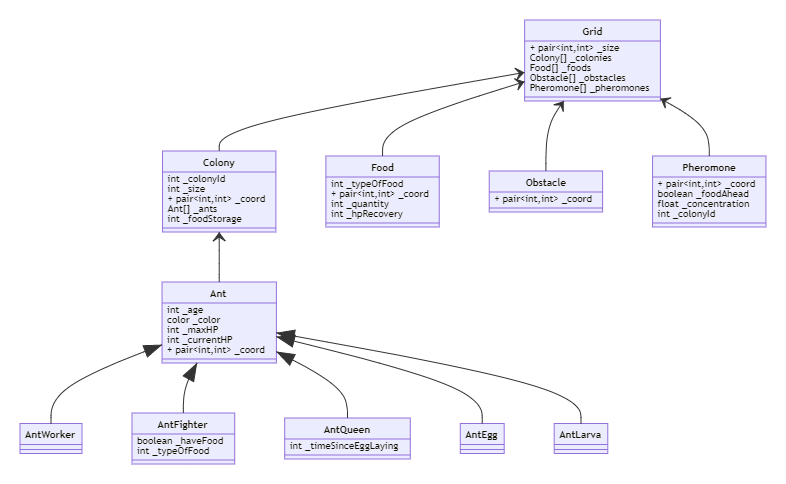
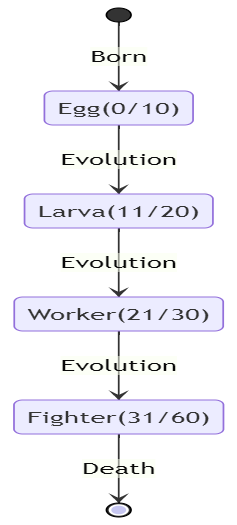
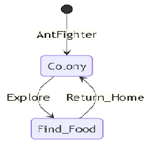

#Documentaiton Ant colony

### Our goal
The goal of this project is to simulate the behavior of an ant colony.
It is developed as a school project in C++ with QT as a graphical library.

###Problematic
- How to simulate an ant ? 
- How to make all the ants move at the same time?
- How to simulate the egg laying of the queen ant ?
- How to simulate multiple ant colony?
- How to simulate an ant war ?
- How to simulate the apearance and disapearance of the food/obstacles ?
- How to make an ihm and place the food/obstacles in real time?

###Class Diagram

###State Diagram of the ant evolution

We stated that the ant will have a fix age at which they will evolve.

| Ant     | HP  | Age   |
|---------|-----|-------|
| Egg     | 30  | 0-10  |
| Larva   | 50  | 11-20 |
| Worker  | 100 | 21-30 |
| Fighter | 200 | 31-60 |
| Queen   | 500 | INF   |

###AntFighter State Diagram

