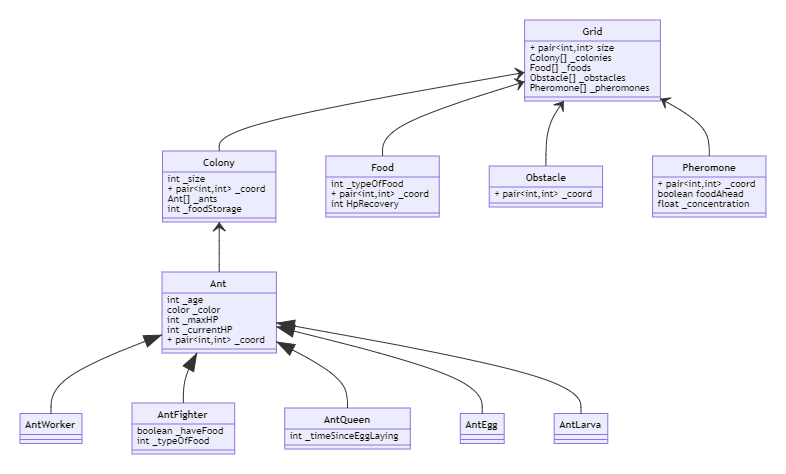
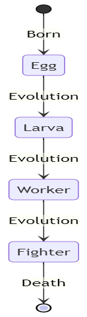
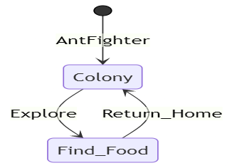

#Documentaiton Ant colony

### Our goal
The goal of this project is to simulate the behavior of an ant colony.
It is developed as a school project in C++ with Gtkmm3 as an ihm library.

###Problematic
- How to simulate an ant ? 
- How to make all the ants move at the same time?
- How to simulate the egg laying of the queen ant ?
- How to simulate multiple ant colony?
- How to simulate an ant war ?
- How to simulate the apearance and disapearance of the food/obstacles ?
- How to make an ihm and place the food/obstacles in real time?
  

###Class Diagram

###State Diagram of the ant evolution

###AntFighter State Diagram

